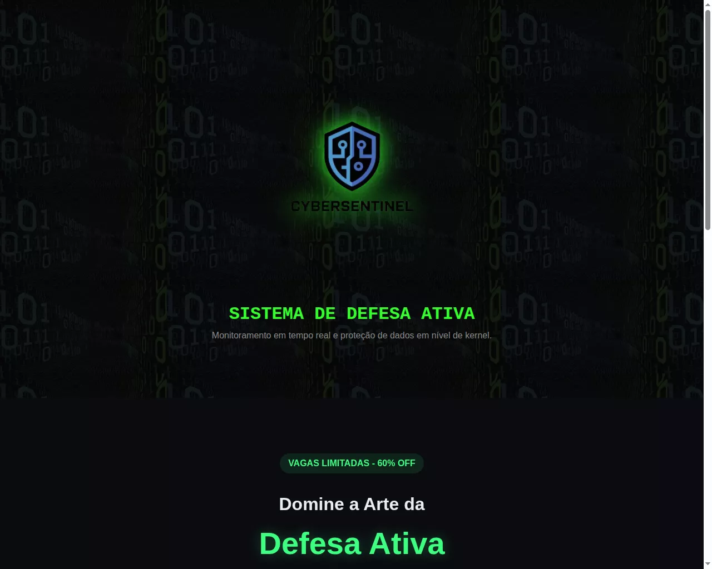
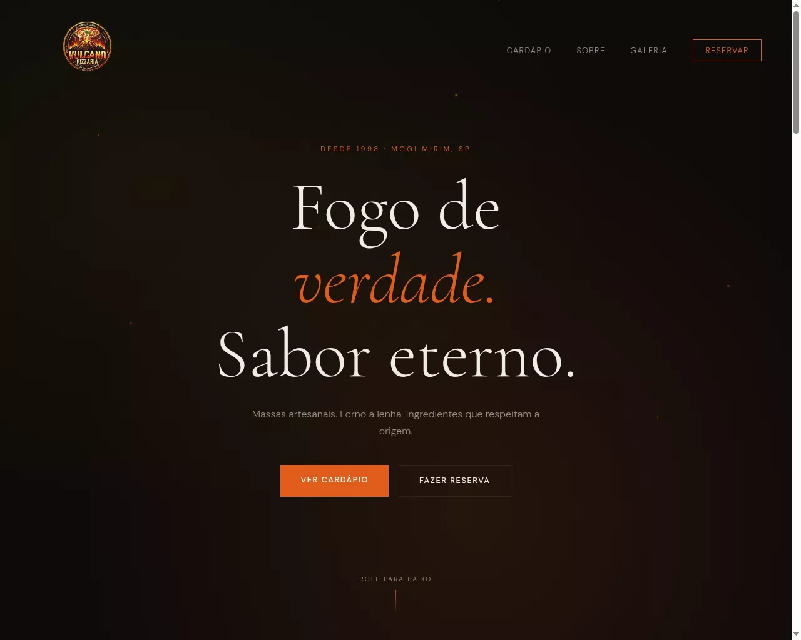
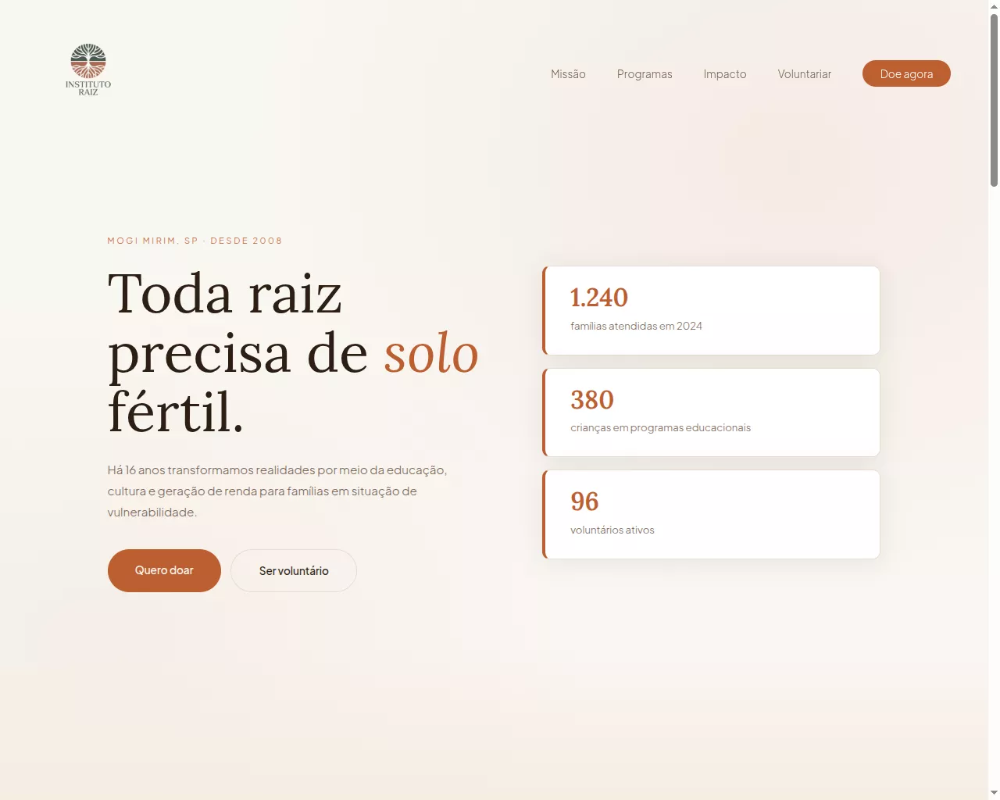
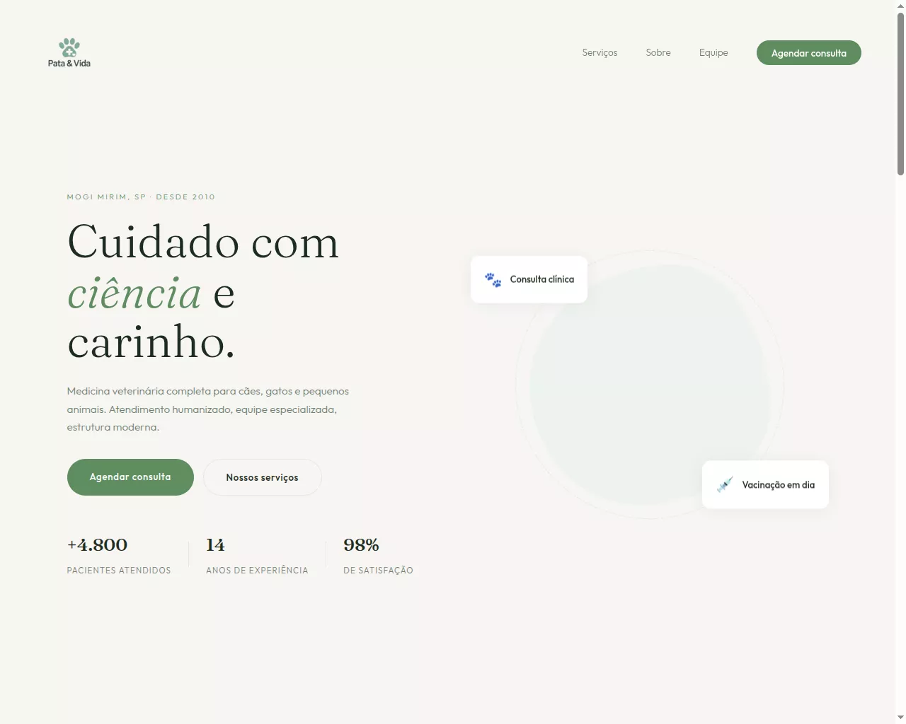

🚀 Landing Pages Collection - Portfolio Project
Este repositório reúne quatro Landing Pages profissionais desenvolvidas como parte do meu portfólio de Front-End na Etec Pedro Ferreira Alves. O foco do projeto foi aplicar conceitos avançados de UI/UX, CSS Grid, Flexbox e otimização de performance.

📁 Projetos Incluídos
🛡️ 1. Cyber Sentinel
Foco: Segurança da Informação e Framework de Defesa Ativa.

Destaque: Estética Dark Mode com temática Hacker, uso de filtros CSS e backgrounds binários.

Tech: HTML5, CSS3 (Custom Properties).

🍕 2. Vulcano Pizzaria
Foco: Gastronomia artesanal e experiência do usuário.

Destaque: Cardápio dinâmico com 9 sabores em Grid, imagens otimizadas em .webp e galeria de fotos com foco no processo produtivo (Forno a Lenha).

🌱 3. Instituto Raiz
Foco: Impacto social e transparência.

Destaque: Hierarquia visual limpa, paleta de cores terrosas e seção de métricas de impacto social totalmente responsiva.

🐾 4. Clínica Pata & Vida
Foco: Cuidado veterinário e acolhimento.

Destaque: Design suave, uso de cores pastéis e foco em conversão (Agendamentos).

🛠️ Tecnologias & Técnicas Utilizadas
HTML5 Semântico: Para melhor SEO e acessibilidade.

CSS3 Moderno: Flexbox, CSS Grid, Variáveis (Root) e animações de scroll (reveal).

Performance: Imagens convertidas para o formato WebP para carregamento ultrarrápido.

Design Responsivo: Adaptado para mobile, tablet e desktop.

🚀 Como visualizar
Clone o repositório:

Bash
git clone https://github.com/rodrigo-pereira/landing-pages.git
Abra o arquivo index.html da raiz no seu navegador ou via Live Server no VS Code.

👨‍💻 Autor
Rodrigo Pereira Estudante de TI na Etec Pedro Ferreira Alves | Desenvolvedor Fullstack em transição (Rust/Next.js)